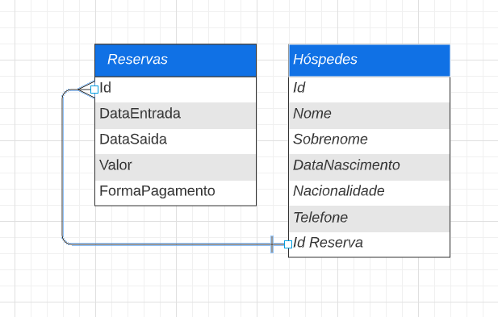

# Challenge 02 ONE | Java | Back-end | Hotel Alura

 

  

 

## :dart: Descrição do Projeto

O desafio desenvolver um sistema de reservas que contenha: 

1. Sistema de autenticação de usuários para que somente usuários pertencentes ao hotel possam acessar o sistema;
2. Permitir criar, editar e excluir uma reserva para clientes;
3. Pesquisar na base de dados toda a informação de clientes e reservas;
4. Registrar, editar e excluir os dados dos hóspedes;
5. Calcule o valor da reserva com base no número de dias da reserva e uma taxa diária com o valor atribuído por você na moeda Real. Por exemplo, se tivermos uma reserva de 3 dias e o valor de nossa diária for de R$20 devemos multiplicar esses 3 dias pelo valor da diária, totalizando R$60. Tudo isso deve ser feito automaticamente e mostrado ao usuário antes de salvar a reserva;
6. Banco de dados para armazenar todos os dados solicitados anteriormente.

## :memo: Diagrama de classes

 

  

 

<h2>Ferramentas utilizadas</h2>

* Visual Studio Code
* Banco de dados H2